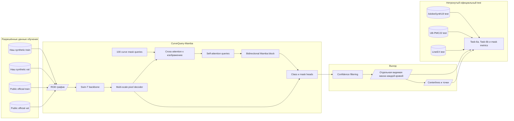

# CurveQuery-Mamba: архитектура первого эксперимента

Статус: версия 0.2, июль 2026.

## 1. Текущая граница проекта

Сейчас собственный датасет у нас только синтетический, но для обучения также можно использовать официальные `train`/`val` части публичных benchmark-наборов. Первый эксперимент решает одну задачу:

> По RGB-изображению графика предсказать неизвестное число отдельных видимых масок кривых.

На этом этапе:

- используем наш synthetic `train/val`;
- используем публичные `train/val`, если они предусмотрены официальным протоколом;
- публичный `test` не используем для обучения, подбора epoch, threshold или гиперпараметров;
- результаты всегда помечаем протоколом обучения, чтобы не смешивать supervised и zero-shot оценки;
- не обучаем OCR, распознавание легенды, осей и числовых значений;
- не используем псевдоразметку SAM3, ручную real-adaptation или VLM;
- не предсказываем скрытую/amodal траекторию, если такой разметки нет в текущем датасете;
- восстановление точек и полинома выполняем после сегментации и оцениваем отдельно.

SAM3 и ранее обученная YOLO могут участвовать только как внешние baselines.

## 2. Что именно проверяем

Основная гипотеза взята из статьи:

[Efficient extraction of experimental data from line charts using advanced machine learning techniques](https://doi.org/10.1016/j.gmod.2025.101259).

Проверяем, помогает ли **Mamba-enhanced Transformer mask-query decoder** лучше разделять длинные, пересекающиеся и частично перекрытые кривые по сравнению с обычным Mask2Former/LineFormer decoder.

Никаких других крупных архитектурных нововведений в первый эксперимент не добавляем. Иначе будет невозможно понять, что именно дало улучшение.

## 3. Архитектура

### 3.1. Backbone

Для первого честного сравнения используем `Swin-T`:

- он применялся в LineFormer;
- помещается на видеокарту с 8 GB VRAM;
- позволяет отделить вклад нового decoder от вклада более крупного backbone.

Более новый backbone можно проверять позже отдельной ablation, но не смешивать с первым результатом.

### 3.2. Multi-scale pixel decoder

Backbone формирует признаки нескольких разрешений. Pixel decoder объединяет их в высокоразрешённое представление:

```text
F1: 1/4
F2: 1/8
F3: 1/16
F4: 1/32
        ↓
multi-scale pixel decoder
        ↓
pixel embedding P ∈ R^(C×H/4×W/4)
```

Высокое разрешение важно, поскольку ширина кривой может составлять всего несколько пикселей.

### 3.3. Curve mask queries

Decoder получает фиксированное число обучаемых query, например `N = 100`, как в LineFormer. Каждый query предсказывает:

- вероятность `curve / no-object`;
- embedding маски;
- независимую маску одного экземпляра кривой.

После confidence filtering число оставшихся query становится числом найденных кривых.

Разные маски могут иметь общие пиксели в местах пересечения. Это допустимо и необходимо: один пиксель изображения может относиться сразу к нескольким логическим кривым.

### 3.4. Mamba-enhanced Transformer decoder

Один слой decoder:

```text
queries
  → cross-attention к multi-scale image features
  → residual + normalization
  → self-attention между curve queries
  → residual + normalization
  → bidirectional Mamba block
  → residual + normalization
```

Cross-attention ставится до self-attention: сначала query получает информацию изображения, затем согласуется с другими query.

Mamba заменяет или расширяет обычный независимый FFN decoder. Цель — передавать дальний контекст и уменьшать фрагментацию маски длинной кривой.

Это единственное существенное отличие основной модели от контрольного Mask2Former/LineFormer decoder.

Перед реализацией `curve mask-guided training` необходимо сверить точное определение из полного текста журнальной статьи. По одному abstract нельзя надёжно восстановить формулу или место применения guidance.

### 3.5. Mask prediction

Для query `i`:

```text
Mi = sigmoid(mask_embedding_i · pixel_embedding)
```

Результат модели:

```text
[
  {score, visible_mask_1},
  {score, visible_mask_2},
  ...
]
```

Центральная линия, точки и PCHIP вычисляются после получения масок и не входят в архитектуру первого обучения.

## 4. Диаграмма



## 5. Обучение

### 5.1. Matching

Истинные кривые сопоставляются с predicted queries через Hungarian matching.

Стоимость сопоставления:

```text
Cmatch = λclass Cclass + λdice Cdice + λmask Cmask
```

### 5.2. Loss первого эксперимента

```text
L = λclass Lclass
  + λdice  Ldice
  + λmask  Lfocal_or_BCE
```

Этого достаточно для первого сравнения. Topology loss, auxiliary trajectory head и дополнительные style embeddings пока не добавляем.

### 5.3. Два обязательных запуска

При одинаковом backbone, данных, seed и настройках обучения:

1. `Baseline`: обычный Transformer/Mask2Former decoder.
2. `Mamba`: тот же decoder, но FFN заменён Mamba-блоком.

Это минимальная ablation, показывающая реальную ценность Mamba.

## 6. Публичный benchmark

Для обучения и сравнения с существующими решениями используем публичную benchmark-линейку, на которой опубликованы результаты LineFormer:

| Набор | Тип | Обучение | Оценка |
|---|---|---|---|
| `AdobeSynth19` | синтетические графики CHART-Info-19 | официальный train/val | официальный test |
| `LineEX` | синтетика с вариативными стилями, формами и пересечениями | официальный train/val | официальный test |
| `UB-PMC22` | реальные графики из PubMed Central | официальный train/val | официальный test |

Официальные обучающие части можно объединять или использовать для fine-tuning, если это соответствует выбранному протоколу. Test split всегда остаётся нетронутым.

Открытая версия LineFormer описывает приблизительно:

- `AdobeSynth19`: около 38 000 синтетических line charts, используется официальный split;
- `LineEX`: в работе LineFormer использовались 40 000 train и 10 000 test;
- `UB-PMC22`: около 1500 train и 158 test real charts.

Перед скачиванием нужно сверить лицензии, официальные split-файлы и контрольные суммы.

### 6.1. Три протокола обучения

Все три протокола оцениваются на одних и тех же официальных test split.

| Протокол | Training data | Что измеряет |
|---|---|---|
| `P0 Public-supervised` | только официальные public train/val | честное сравнение с опубликованными методами |
| `P1 Synthetic-only` | только наш synthetic train/val | zero-shot перенос генератора на публичные данные |
| `P2 Synthetic→Public` | synthetic pretraining, затем официальный public train/val | максимальное качество и пользу синтетического pretraining |

В итоговой таблице результаты разных протоколов не объединяются в одну колонку. Использование дополнительной синтетики явно отмечается.

Если у набора нет официального `val`, выделяем детерминированную validation-часть только из его train split и сохраняем список файлов в manifest. Test для этого не используется.

## 7. Основные метрики сравнения

### 7.1. CHART-Info Task-6a

Visual Element Detection Score:

- сопоставляет predicted и ground-truth кривые через максимальное bipartite matching;
- измеряет прежде всего полноту;
- лишние predicted curves почти не штрафуются.

### 7.2. CHART-Info Task-6b

Data Extraction Score:

- использует то же сопоставление по восстановленным `y(x)`;
- штрафует пропущенные и лишние кривые;
- является основной метрикой для нашего случая, потому что модель должна выдать правильное количество масок.

### 7.3. Дополнительные метрики

Для диагностики сохраняем:

- exact curve-count accuracy;
- precision/recall по экземплярам;
- mask Dice и tolerant IoU;
- centerline F1 с допуском 1–3 px;
- среднюю ошибку `y(x)` после извлечения точек;
- долю разорванных масок;
- результат отдельно на пересечениях, одинаковых цветах, легендах и плохом crop.

Публикуем одновременно Task-6a и Task-6b. Высокий Task-6a при низком Task-6b обычно означает лишние или дублирующиеся кривые.

## 8. Сравниваемые решения

Первый benchmark table:

| Метод | Статус |
|---|---|
| ChartOCR | внешний keypoint baseline, если официальный checkpoint запускается |
| LineEX | внешний keypoint/legend baseline |
| LineFormer | основной instance-segmentation baseline |
| Mamba-enhanced mask queries из статьи 2025 | сравнение с опубликованными числами или checkpoint, если он доступен |
| Наша прежняя YOLO | внутренний baseline |
| OpenCV + SAM3 | внутренний zero-shot baseline |
| CurveQuery-Mamba | наша модель |

Для воспроизводимого сравнения отдельно отмечаем:

- число параметров;
- FLOPs или MACs при одном разрешении;
- VRAM;
- latency на одной и той же GPU;
- использованные training data;
- был ли benchmark dataset виден при обучении.

## 9. Что делаем первым

1. Замораживаем текущую версию synthetic train/val и записываем manifest с seed.
2. Реализуем официальный Task-6a/Task-6b evaluator.
3. Загружаем официальные train/val/test split публичных benchmark-наборов.
4. Фиксируем manifests и проверяем, что test не попал в обучение.
5. Запускаем официальный LineFormer как контроль воспроизводимости метрик.
6. Обучаем обычный decoder и Mamba-decoder по протоколу `P0 Public-supervised`.
7. Повторяем оба запуска по `P1 Synthetic-only`.
8. После этого проверяем `P2 Synthetic→Public`.
9. Сравниваем все модели на одних и тех же нетронутых test split.

До получения этих результатов расширять архитектуру дополнительными heads и teacher-моделями не нужно.

## 10. Источники

- [Статья с Mamba-enhanced Transformer mask queries, Graphical Models 2025](https://doi.org/10.1016/j.gmod.2025.101259)
- [LineFormer](https://arxiv.org/abs/2305.01837)
- [Официальный репозиторий LineFormer](https://github.com/TheJaeLal/LineFormer)
- [Открытый предшествующий вариант работы тех же авторов](https://doi.org/10.21203/rs.3.rs-2892637/v1)
